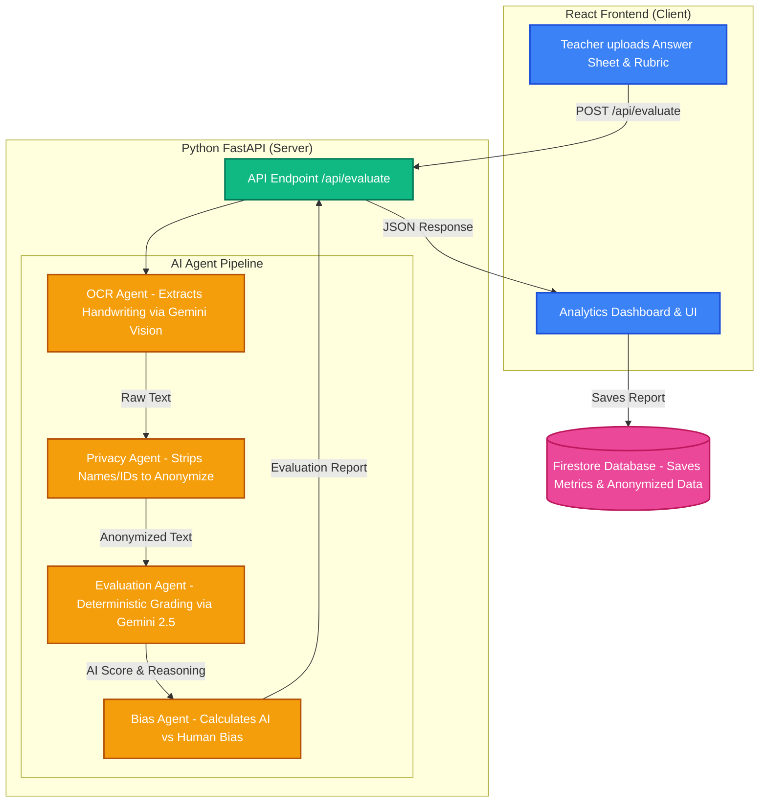

# 🏆 FairGrade AI — Bias Detection in Student Grading


FairGrade AI is an intelligent, multi-agent evaluation platform built for the **Google Solution Challenge 2026**. It ensures fair, unbiased evaluation of student answer sheets by extracting handwriting via multimodal AI, stripping identity markers to prevent implicit bias, and comparing human teacher grades against an objective AI baseline.

## 🚀 Live Demo & Links

| Resource | Link |
|----------|------|
| 🌐 **Live Website** | [FairGrade AI on Vercel](https://project-xq9vm.vercel.app/) |
| ⚙️ **Backend API** | [FairGrade Backend on Render](https://fairgrade-backend.onrender.com) |
| 📂 **Source Code** | You're here! |


## ✨ Key Features
- **Multimodal OCR (Gemini 2.5 Flash):** Automatically extracts handwriting directly from uploaded images and PDFs. 
- **Universal Problem Solver:** Provide any custom question and rubric. The AI reads the student's answer and evaluates it strictly based on factual correctness.
- **Privacy Engine:** Automatically redacts names, Student IDs, and Roll Numbers to create an "Anonymized Trajectory" before grading occurs.
- **Bias Detection & Analytics:** Flags evaluations as *Undergraded*, *Overgraded*, or *Fair*. All data is aggregated into an interactive dashboard to spot systemic grading bias across classrooms.
- **Fault-Tolerant AI Pipeline:** Built-in automatic fallback mechanisms across multiple Gemini models (`gemini-2.5-flash`, `gemini-2.0-flash-lite`, etc.) to bypass rate limits and ensure 100% uptime.

---

## 🏗️ System Architecture & Workflow

FairGrade AI uses a highly secure Client-Server architecture. To protect privacy, images are processed securely in memory by the backend and immediately destroyed.



## 🛠️ Tech Stack

*   **Frontend:** React, Vite, Tailwind CSS, Recharts
*   **Backend:** Python, FastAPI, Uvicorn
*   **AI Models:** Google Gemini 2.5 Flash, Gemini 2.0 Flash Lite (with Fallback Engine)
*   **Database:** Firebase Firestore
*   **Deployment:** Render / Vercel

---

## 🚀 Local Setup Instructions

### 1. Backend (Python/FastAPI)

The backend handles the core FairGrade AI multi-agent system.

1. Install the Python dependencies:
   ```bash
   pip install -r requirements.txt
   ```
2. Create a `.env` file in the root directory and add your API key:
   ```env
   GEMINI_API_KEY=your_gemini_api_key_here
   ```
3. Start the server:
   ```bash
   uvicorn app:app --reload --port 8000
   ```

### 2. Frontend (React/Vite)

1. Open a new terminal and navigate to the frontend directory:
   ```bash
   cd fairgrade-ai
   ```
2. Install dependencies:
   ```bash
   npm install
   ```
3. Create a `.env` file in the `fairgrade-ai` folder with your backend URL and Firebase config:
   ```env
   VITE_API_URL=http://localhost:8000
   VITE_FIREBASE_API_KEY=your_firebase_key
   VITE_FIREBASE_PROJECT_ID=your_project_id
   # ...other firebase config
   ```
4. Start the Vite server:
   ```bash
   npm run dev
   ```

---

## ☁️ Deployment

- **Backend:** Can be deployed as a Web Service on **Render.com** or **Google Cloud Run**. (Use the provided `requirements.txt`).
- **Frontend:** Can be deployed to **Vercel** or **Firebase Hosting**. Make sure to update `VITE_API_URL` to point to your live backend URL before deploying.

---

## 👥 Team VEKTOR ⚡

*Built with ❤️ for the Google Solution Challenge 2026*
