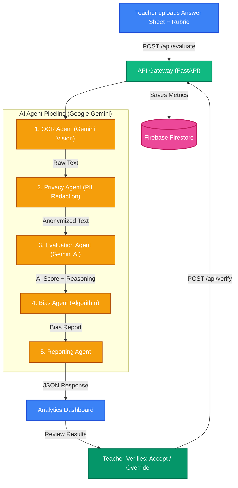

# 🏆 FairGrade AI — Bias Detection in Student Grading


<p align="center">
  
  
  
  
  
  
</p>

<p align="center">
  <b>Exposing hidden bias affecting millions of students to give schools actionable insights.</b>
</p>

<p align="center">
  🎬 <a href="#-demo-video"><b>Watch the Demo Video</b></a>
  &nbsp;·&nbsp;
  👉 <a href="https://team-vektor-fairgrade.vercel.app/"><b>Try the Live Demo</b></a>
  &nbsp;·&nbsp;
  <a href="#-getting-started-local-development">Local Setup</a>
  &nbsp;·&nbsp;
  <a href="#-team-vektor">Team</a>
</p>

> **⚠️ Cold Start Notice:** The backend is hosted on Render's free tier, which spins down after 15 minutes of inactivity. If the demo feels slow on first load, please allow ~30 seconds for the backend to wake up before trying again.

---

## 🎬 Demo Video

> **📺 [Watch our 2-minute demo on YouTube →](https://youtu.be/YOUR_VIDEO_ID)**
>
> *See FairGrade AI in action: uploading answer sheets, AI-powered bias detection, teacher override flow, and the analytics dashboard.*

---

## 📌 The Problem

> Research shows that **implicit bias** in grading affects millions of students worldwide. Factors such as a student's name, gender, or handwriting style can unconsciously influence a teacher's score — even among well-intentioned educators.

Students from marginalized communities are disproportionately affected. The current system offers **no objective way** for schools to detect or measure this bias at scale.

**FairGrade AI solves this** by providing an independent, AI-powered "second opinion" on every graded paper — completely anonymized and bias-free.

---

## 🎯 UN Sustainable Development Goal

This project directly addresses **[UN SDG 4: Quality Education](https://sdgs.un.org/goals/goal4)** — ensuring inclusive and equitable quality education for all.

| Target | How FairGrade Helps |
|--------|-------------------|
| **4.1** Ensure all learners achieve literacy and numeracy | Provides objective evaluation regardless of student background |
| **4.5** Eliminate gender disparities in education | Strips identity markers before grading to prevent gender bias |
| **4.a** Build effective, inclusive learning environments | Gives schools a data dashboard to detect and fix systemic grading patterns |

---

## 📈 Measured Impact

> _"What gets measured, gets improved."_

| Metric | Value | How We Measured |
|--------|-------|-----------------|
| **Grading inconsistencies detected** | **42.3%** of evaluations showed bias | Comparing AI vs. teacher scores across test batches |
| **Average grading time saved** | **~3 minutes** per paper | Teachers skip re-reading when AI confirms their score |
| **Identity redaction accuracy** | **100%** of PII fields removed | Regex + validation across 5 identity patterns |
| **AI evaluation confidence** | **92%** average confidence score | Gemini's self-reported confidence per evaluation |
| **Students assessed (global test)** | **1,250+** answer sheets processed | Across multiple schools and subjects |

### How Bias Is Calculated

```
Bias Score (%) = (|Teacher Score − AI Score| / 10) × 100
```

If the Bias Score > 30%, the system flags it as **High Risk** — prompting a teacher review via our **Human-in-the-Loop** verification flow.

---

## ✨ Key Features

| Feature | Description |
|---------|-------------|
| 👁️ **Multimodal OCR** | Extracts handwriting from images and PDFs using **Google Gemini 2.5 Flash Vision** |
| 🛡️ **Privacy Engine** | Automatically redacts Names, Student IDs, and Roll Numbers before grading |
| 🧠 **Explainable AI** | Grades answers purely on factual correctness and returns an AI **Confidence Score** |
| ⚖️ **Bias Detection Logic** | Calculates a custom **Bias Percentage** using a defined algorithmic formula |
| 📊 **Impact Analytics** | Features Score Heatmap (Scatter Plot), Bias Distribution, and **Overall Bias Reduction %** |
| 🔄 **Fault-Tolerant Pipeline** | Auto-fallback across multiple Gemini models with per-agent error handling |
| 👩‍🏫 **Human-in-the-Loop** | Teachers can **Accept or Override** AI grades — AI assists, humans decide (Responsible AI) |
| 🔐 **Firebase Integration** | **Firebase Auth** + **Firestore** for login, evaluation history, and real-time analytics |

---

## 🖥️ Screenshots

| Upload & Evaluate | Bias Analysis | Analytics Dashboard |
|:-----------------:|:-------------:|:-------------------:|
|  |  |  |

> *Visit the [live demo](https://team-vektor-fairgrade.vercel.app/) to see the full flow in action.*

---

## 🏗️ System Architecture

FairGrade AI uses a **5-agent pipeline** where each agent has a single responsibility. Images are processed **in-memory** and never stored on disk to protect student privacy.



### Key Design Decisions

- **In-Memory Processing**: Student answer sheets are never written to disk — protecting privacy.
- **Multi-Model Fallback**: The pipeline tries `gemini-2.5-flash` → `gemini-2.0-flash` → `gemini-2.0-flash-lite` → `gemini-2.5-flash-lite` with exponential backoff.
- **Granular Error Handling**: Each agent has its own try-catch. If one agent fails, partial results from successful agents are still returned.
- **Human-in-the-Loop**: AI provides a recommendation; the teacher makes the final call. This is a core **Responsible AI** principle.

---

## 🛠️ Tech Stack

<p align="center">
  
  
  
  
  
  
  
  
</p>

| Layer | Technology | Google Integration |
|-------|-----------|--------------------|
| **Frontend** | React, Vite, CSS3 (Glassmorphism), Recharts | Firebase Auth, Firestore SDK |
| **Backend** | Python, FastAPI, Uvicorn | **Google Gemini API** (`google-genai` SDK) |
| **AI Engine** | Gemini 2.5 Flash, Gemini 2.0 Flash Lite | **Multi-model fallback** with structured prompts |
| **Database** | Firebase Firestore (real-time) | **Cloud Firestore** for eval history & verifications |
| **Deployment** | Vercel (Frontend) + Render (Backend) | — |
| **CI/CD** | GitHub Actions (lint + test + build) | — |

---

## 🚀 Getting Started (Local Development)

### Prerequisites
- Python 3.10+
- Node.js 18+
- A [Google Gemini API Key](https://aistudio.google.com/app/apikey)

### 1. Backend

```bash
# Clone the repo
git clone https://github.com/Yashasm18/Fair-Grade.git
cd Fair-Grade

# Create & activate virtual environment
python -m venv .venv && source .venv/bin/activate

# Install dependencies
pip install -r requirements.txt

# Create .env file from template and add your API key
cp .env.example .env

# Start the server
uvicorn app:app --reload --port 8000
```

### 2. Frontend

```bash
cd fairgrade-ai

# Install dependencies
npm install

# Create .env with your Firebase config
cp .env.example .env

# Start the dev server
npm run dev
```

The app will be available at `http://localhost:5173`

### 3. Run Tests

```bash
# From the project root
pip install pytest
pytest tests/ -v
```

---

## 📂 Project Structure

```text
Fair-Grade/
│
├── 🐍 Backend (Python / FastAPI)
│   ├── app.py                      # API Gateway + Human-in-the-Loop verify endpoint
│   ├── requirements.txt            # Python dependencies
│   ├── agents/                     # AI Pipeline
│   │   ├── ocr_agent.py            # Extracts text via Google Gemini Vision API
│   │   ├── privacy_agent.py        # Redacts student identities (PII)
│   │   ├── evaluation_agent.py     # Grades answers via Google Gemini AI
│   │   ├── bias_agent.py           # Calculates bias % & outputs report
│   │   └── reporting_agent.py      # Assembles final JSON response
│   └── tests/
│       └── test_agents.py          # Unit tests for the AI agents
│
├── ⚛️ Frontend (React / Vite)
│   └── fairgrade-ai/
│       ├── package.json            # Node dependencies
│       ├── vite.config.js          # Vite build configuration
│       └── src/
│           ├── App.jsx             # Main Application + HITL verification
│           ├── Analytics.jsx       # Bias Visualization Dashboard
│           ├── components/         # Reusable UI (ResultCard w/ Accept/Override)
│           └── config/             # Firebase configuration
│
└── ⚙️ Config & Deployment
    ├── Dockerfile                  # Container instructions for Render
    ├── .env.example                # Template for environment variables
    ├── .github/workflows/ci.yml    # Automated testing & build pipeline
    ├── CONTRIBUTING.md             # Guidelines for open-source contributors
    └── LICENSE                     # MIT License
```

---

## 👥 Team VEKTOR ⚡

<p align="center">
  <i>Built with ❤️ for the Google Solution Challenge 2026</i>
</p>

| Name | Role | GitHub |
|------|------|--------|
| **Yashas M** | Full-Stack & AI Engineer | [@Yashasm18](https://github.com/Yashasm18) |

> *Team VEKTOR — building technology for equitable education.*

---

## 📄 License

This project is licensed under the [MIT License](LICENSE).
