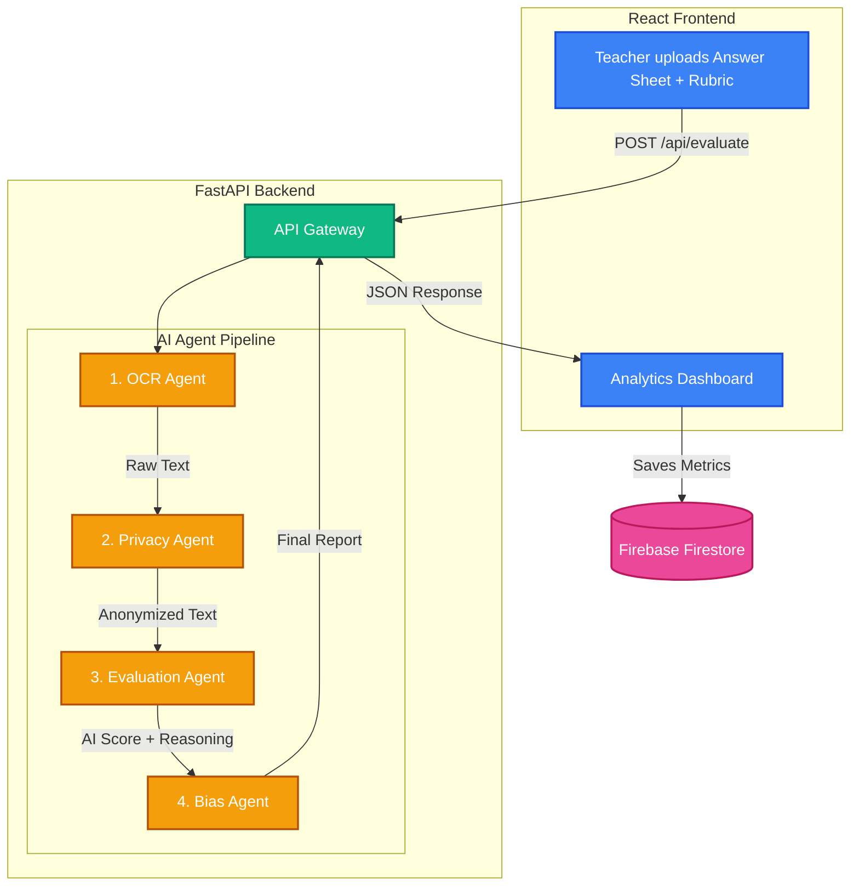

# 🏆 FairGrade AI — Bias Detection in Student Grading


<p align="center">
  
  
  
  
</p>

<p align="center">
  <b>An intelligent, multi-agent evaluation platform that detects and mitigates systemic bias in student grading.</b>
</p>

<p align="center">
  👉 <a href="https://team-vektor-fairgrade.vercel.app/"><b>Try the Live Demo</b></a>
</p>

---

## 📌 The Problem

> Research shows that **implicit bias** in grading affects millions of students worldwide. Factors such as a student's name, gender, or handwriting style can unconsciously influence a teacher's score — even among well-intentioned educators.

Students from marginalized communities are disproportionately affected. The current system offers **no objective way** for schools to detect or measure this bias at scale.

**FairGrade AI solves this** by providing an independent, AI-powered "second opinion" on every graded paper — completely anonymized and bias-free.

---

## 🎯 UN Sustainable Development Goal

This project directly addresses **[SDG 4: Quality Education](https://sdgs.un.org/goals/goal4)** — ensuring inclusive and equitable quality education for all.

| Target | How FairGrade Helps |
|--------|-------------------|
| **4.1** Ensure all learners achieve literacy and numeracy | Provides objective evaluation regardless of student background |
| **4.5** Eliminate gender disparities in education | Strips identity markers before grading to prevent gender bias |
| **4.a** Build effective, inclusive learning environments | Gives schools a data dashboard to detect and fix systemic grading patterns |

---

## ✨ Key Features

| Feature | Description |
|---------|-------------|
| 👁️ **Multimodal OCR** | Extracts handwriting from images and PDFs using Gemini 2.5 Flash Vision |
| 🛡️ **Privacy Engine** | Automatically redacts Names, Student IDs, and Roll Numbers before grading |
| 🧠 **AI Evaluation** | Grades answers based purely on factual correctness against a rubric |
| ⚖️ **Bias Detection** | Compares AI score vs. Teacher score and flags *Undergraded*, *Overgraded*, or *Fair* |
| 📊 **Analytics Dashboard** | Aggregates all results into interactive charts to spot systemic classroom bias |
| 🔄 **Fault-Tolerant Pipeline** | Auto-fallback across multiple Gemini models to ensure 100% uptime |

---

## 🏗️ System Architecture

FairGrade AI uses a **4-agent pipeline** where each agent has a single responsibility. Images are processed **in-memory** and never stored on disk to protect student privacy.



---

## 🛠️ Tech Stack

<p align="center">
  
  
  
  
  
  
  
  
</p>

| Layer | Technology |
|-------|-----------|
| **Frontend** | React, Vite, CSS3 (Glassmorphism), Recharts |
| **Backend** | Python, FastAPI, Uvicorn |
| **AI Engine** | Google Gemini 2.5 Flash, Gemini 2.0 Flash Lite (with automatic fallback) |
| **Database** | Firebase Firestore (real-time) |
| **Deployment** | Vercel (Frontend) + Render (Backend) |

---

## 🚀 Getting Started (Local Development)

### Prerequisites
- Python 3.10+
- Node.js 18+
- A [Google Gemini API Key](https://aistudio.google.com/app/apikey)

### 1. Backend

```bash
# Install dependencies
pip install -r requirements.txt

# Create .env file
echo "GEMINI_API_KEY=your_key_here" > .env

# Start the server
uvicorn app:app --reload --port 8000
```

### 2. Frontend

```bash
cd fairgrade-ai

# Install dependencies
npm install

# Create .env with your Firebase config
cp .env.example .env

# Start the dev server
npm run dev
```

The app will be available at `http://localhost:5173`

---

## 📂 Project Structure

```
Fair-Grade/
├── app.py                  # FastAPI backend (all 4 AI agents)
├── requirements.txt        # Python dependencies
├── Dockerfile              # Container deployment config
├── README.md
└── fairgrade-ai/           # React frontend
    ├── src/
    │   ├── App.jsx         # Main application
    │   ├── Analytics.jsx   # Bias analytics dashboard
    │   ├── components/     # Reusable UI components
    │   └── config/         # Firebase configuration
    ├── package.json
    └── vite.config.js
```

---

## 👥 Team VEKTOR ⚡

<p align="center">
  <i>Built with ❤️ for the Google Solution Challenge 2026</i>
</p>
