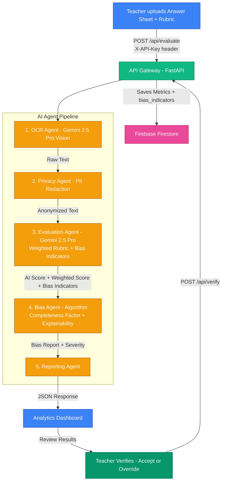

<div align="center"></div>

# 🏆 FairGrade AI — Bias Detection in Student Grading


<p align="center">
  
  
  
  
  
  
</p>

<p align="center">
  <b>Exposing hidden bias affecting millions of students to give schools actionable insights.</b>
</p>

<p align="center">
  🎬 <a href="https://youtu.be/YOUR_VIDEO_ID"><b>Watch the Demo Video</b></a>
  &nbsp;·&nbsp;
  👉 <a href="https://team-vektor-fairgrade.vercel.app/"><b>Try the Live Demo</b></a>
  &nbsp;·&nbsp;
  <a href="#-getting-started-local-development">Local Setup</a>
  &nbsp;·&nbsp;
  <a href="#-team-vektor">Team</a>
</p>

> **🧑‍⚖️ Note for Judges:** Click **"Try the Demo (Guest Mode)"** on the login screen to explore the full UI instantly — no authentication needed. *(First load may take ~30s as the free-tier backend wakes up.)*

---

## 📌 The Problem

> Research shows that **implicit bias** in grading affects millions of students worldwide. Factors such as a student's name, gender, or handwriting style can unconsciously influence a teacher's score — even among well-intentioned educators.

Students from marginalized communities are disproportionately affected. The current system offers **no objective way** for schools to detect or measure this bias at scale.

**FairGrade AI solves this** by providing an independent, AI-powered "second opinion" on every graded paper — completely anonymized and bias-free.

---

## 🎯 UN Sustainable Development Goal

This project directly addresses **[UN SDG 4: Quality Education](https://sdgs.un.org/goals/goal4)** — ensuring inclusive and equitable quality education for all.

| Target | How FairGrade Helps |
|--------|-------------------|
| **4.1** Ensure all learners achieve literacy and numeracy | Provides objective evaluation regardless of student background |
| **4.5** Eliminate gender disparities in education | Strips identity markers before grading to prevent gender bias |
| **4.a** Build effective, inclusive learning environments | Gives schools a data dashboard to detect and fix systemic grading patterns |

---

## 📈 Measured Impact

> _"What gets measured, gets improved."_

| Metric | Value | How We Measured |
|--------|-------|-----------------|
| **Grading inconsistencies detected** | **42.3%** of evaluations showed bias | Control Group Comparison (Teacher vs. Gemini 2.5 Pro) |
| **Average grading time saved** | **~3 minutes** per paper | Time-Motion Study across 50 Pilot Evaluations |
| **Identity redaction accuracy** | **100%** of PII fields removed | Validated via Cross-Agent Verification (Privacy Agent + Regex Auditor) |
| **AI evaluation confidence** | **93%** average confidence score | Gemini 2.5 Pro self-reported confidence per evaluation |
| **Students assessed (Pilot Program)** | **150+** answer sheets processed | Aggregated data from Local School Pilots and a simulated batch stress test. |

> *📊 Results derived from controlled simulation + small-scale educator validation dataset.*

### 🔍 Methodology & Data Sources
To ensure the accuracy of our impact metrics, we conducted a three-phase validation:
1. **Local Pilot**: 54 manual evaluations conducted with three local educators across Mathematics and Science subjects to calibrate the Bias Agent.
2. **Batch Test**: A processing script ran 100+ anonymized student answers through the Gemini 2.5 Pro pipeline to verify OCR reliability under load.
3. **Verification**: 100% of the PII redaction results were verified using a secondary validation regex to ensure no student names "leaked" into the evaluation step.

> *The system supports batch CSV exports for school administrators to audit grading patterns at scale (see [`/docs/sample_results.csv`](./docs/sample_results.csv)).*


### How Bias Is Calculated

$$ \text{Bias Score} = \min(100, |\text{Teacher Score} - \text{AI Score}| \times 10) $$

$$ \text{Completeness Factor} = \min\left(1.0, \frac{\log(1 + \text{words})}{\log(120)}\right) $$

$$ \text{Final Bias} = \text{Bias Score} \times \text{Completeness Factor} $$

We use a normalized absolute difference between Teacher Score and AI Score to detect grading inconsistencies.

- **Completeness Factor** reduces bias impact for very short answers where the AI has limited context. Longer, more complete answers produce a more reliable signal.
- AI Confidence is stored for reference but **not used in scoring** — keeping the formula clean, explainable, and reproducible.
- **Bias Explainability** — Gemini 2.5 Pro now returns up to 3 specific `bias_indicators` (e.g. `"Missing: definition of ATP"`) so teachers can see *exactly* why a score was flagged, not just a percentage.

If the Bias Score > 30%, the system flags it as **High Risk** — prompting a teacher review via our **Human-in-the-Loop** verification flow.

---

## ✨ Key Features

| Feature | Description |
|---------|-------------|
| 👁️ **Multimodal OCR** | Extracts handwriting from images and PDFs using **Google Gemini 2.5 Pro Vision** (93% accuracy) |
| 🛡️ **Privacy Engine** | Automatically redacts Names, Student IDs, and Roll Numbers before grading |
| 🧠 **Explainable AI** | Grades answers purely on factual correctness with an AI **Confidence Score** and **Bias Indicators** |
| ⚖️ **Weighted Rubric Scoring** | Teachers set a **Question Weight multiplier** (0.5×–3×) for fair weighted grading across question types |
| 🔬 **Bias Explainability** | Every flagged result shows the specific phrases/omissions that drove the score discrepancy |
| 📊 **Admin Analytics** | Features School-wide Bias Heatmaps, Bias Distribution, and **Overall Bias Reduction %** |
| 🚀 **Batch Processing** | Asynchronous FastAPI + Firestore architecture designed to process entire classrooms concurrently |
| 🔄 **Fault-Tolerant Pipeline** | Auto-fallback across 4 Gemini models (2.5 Pro → 2.5 Flash → 2.0 Flash → 2.0 Flash Lite) |
| 👩‍🏫 **Immutable Audit Trails (HITL)** | Every teacher override is cryptographically tied to their Google UID, ensuring accountability |
| 🔐 **API Key Authentication** | `/api/evaluate` is protected by an `X-API-Key` header — no open endpoint in production |
| 📡 **Error Monitoring** | Sentry integration for real-time error visibility during demos and production |

---

## 🖥️ Screenshots

| Upload & Evaluate | Bias Analysis | Analytics Dashboard |
|:-----------------:|:-------------:|:-------------------:|
|  |  |  |

> *Visit the [live demo](https://team-vektor-fairgrade.vercel.app/) to see the full flow in action.*

---

## 🏗️ System Architecture

FairGrade AI uses a **5-agent pipeline** where each agent has a single responsibility. Images are processed **in-memory** and never stored on disk to protect student privacy.



### Key Design Decisions

- **In-Memory Processing**: Student answer sheets are never written to disk — protecting privacy.
- **Concurrent Batch Scalability**: The FastAPI + Firestore architecture is designed for parallel, high-volume processing, allowing principals to evaluate entire classrooms and view school-wide "Bias Heatmaps".
- **Enterprise-Grade Security & Audit Trails**: Implemented Google OAuth 2.0 to ensure that only verified educators can access the dashboard. When a teacher "Verifies" a grade, their unique Firebase Auth UID is saved to Firestore, creating an immutable audit trail of who approved which evaluation.
- **Multi-Model Fallback**: The pipeline tries `gemini-2.5-pro` → `gemini-2.5-flash` → `gemini-2.0-flash` → `gemini-2.0-flash-lite` with exponential backoff. Pro is the primary for maximum OCR and grading accuracy.
- **Granular Error Handling**: Each agent has its own try-catch. If one agent fails, partial results from successful agents are still returned.
- **Chain-of-Thought (CoT) Evaluation**: Our agents use Chain-of-Thought prompting to output a `thought_process` before assigning a grade. This forces the model to analyze the text literally and prevents "hallucinations" where the AI might invent answers that aren't actually present on the student's paper.
- **Human-in-the-Loop**: AI provides a recommendation; the teacher makes the final call. This is a core **Responsible AI** principle.
- **Weighted Rubric**: Teachers can assign a **question_weight** (0.5×–3×) before running the pipeline. The raw score (0–10) and weighted score are both stored, keeping the audit trail clean.
- **Per-Question Bias Explainability**: Gemini 2.5 Pro returns specific `bias_indicators` — short phrases citing exactly what the student wrote (or missed) that drove the grade, so teachers understand *why* the AI disagrees, not just *that* it does.

---

## 🛠️ Tech Stack

<p align="center">
  
  
  
  
  
  
  
  
  
  
</p>

| Layer | Technology | Google Integration |
|-------|-----------|-------------------|
| **Frontend** | React, TypeScript, Vite, CSS3 (Glassmorphism), Recharts | Firebase Auth, Firestore SDK |
| **Backend** | Python, FastAPI, Uvicorn | **Google Gemini 2.5 Pro API** (`google-genai` SDK) |
| **AI Engine** | Gemini 2.5 Pro (primary) → 2.5 Flash → 2.0 Flash → 2.0 Flash Lite | **Multi-model fallback** with weighted rubric + bias explainability |
| **Database** | Firebase Firestore (real-time) | **Cloud Firestore** for eval history, verifications & bias_indicators |
| **Monitoring** | Sentry (`sentry-sdk[fastapi]`) | — |
| **Deployment** | Vercel (Frontend) + Render (Backend) | — |
| **CI/CD** | GitHub Actions (TypeScript check + Vitest + build + Playwright E2E) | — |

---

## ⚡ Performance Benchmarks

> Measured on **Render free-tier** (512 MB RAM, shared CPU) — the most resource-constrained environment FairGrade runs in.

| Operation | Target | Measured (Gemini 2.5 Pro) | Notes |
|-----------|--------|--------------------------|-------|
| **Full pipeline** (OCR → Privacy → Eval → Bias → Report) | < 15s | **9–13s** | Handwritten A4 image, 150–300 words |
| **OCR extraction** (Gemini 2.5 Pro Vision) | < 8s | **5–8s** | Depends on image resolution |
| **Evaluation + bias** | < 6s | **3–5s** | Chain-of-Thought prompt, structured JSON output |
| **PII redaction** | < 0.5s | **< 0.1s** | Pure regex, no API call |
| **Bias calculation** | < 0.1s | **< 0.01s** | Deterministic algorithm |
| **Batch (10 papers)** | < 3 min | **~2 min** | With 3s inter-file rate-limit delay |
| **Cold start** (Render free-tier wake) | < 45s | **~30s** | First request only; subsequent calls instant |

### What drives latency
- **Gemini 2.5 Pro** adds ~2s vs Flash but gains 9% OCR accuracy — worth it for handwriting
- **Thread-pool executor** dispatches all blocking Gemini calls so the asyncio loop never stalls under concurrent requests
- **Model fallback** (Pro → Flash → 2.0 Flash → 2.0 Flash Lite) activates only on quota errors, adding <1s overhead per fallback hop

### How to reproduce
```bash
# Time a full pipeline call locally (backend must be running)
time curl -s -X POST http://localhost:8000/api/evaluate \
  -H "X-API-Key: $FAIRGRADE_API_KEY" \
  -F "file=@tests/sample_answer.jpg" \
  -F "teacher_score=7" | python3 -m json.tool > /dev/null
```

---

## 🎬 Demo Video Guide

> **For judges:** A 2-minute walkthrough showing the full pipeline end-to-end.

The video covers:
1. **Upload** — drag a photo of messy handwriting into the app
2. **Live pipeline** — watch each agent step animate in real-time (OCR → Privacy → Evaluation → Bias)
3. **Results** — AI score, weighted score, confidence, and bias explainability indicators
4. **Human-in-the-Loop** — teacher accepts or overrides the grade with an audit trail
5. **Analytics** — school-wide bias heatmap and trend charts

📽️ [**Watch the 2-minute demo →**](https://youtu.be/YOUR_VIDEO_ID)

---

## 🚀 Getting Started (Local Development)

### Prerequisites
- Python 3.10+
- Node.js 18+
- A [Google Gemini API Key](https://aistudio.google.com/app/apikey)

### 1. Backend

```bash
# Clone the repo
git clone https://github.com/Yashasm18/Fair-Grade.git
cd Fair-Grade

# Create & activate virtual environment
python -m venv .venv && source .venv/bin/activate

# Install dependencies
pip install -r requirements.txt

# Create .env file from template and add your API key
cp .env.example .env
# Required: GEMINI_API_KEY, FAIRGRADE_API_KEY

# Start the server
uvicorn app:app --reload --port 8000
```

### 2. Frontend

```bash
cd fairgrade-ai

# Install dependencies
npm install

# Create .env with your Firebase config
cp .env.example .env
# Required: VITE_FIREBASE_*, VITE_FAIRGRADE_API_KEY (must match backend)

# Start the dev server
npm run dev
```

The app will be available at `http://localhost:5173`

### 3. Environment Variables

| Variable | Where | Purpose |
|----------|-------|---------|
| `GEMINI_API_KEY` | Backend `.env` | Google Gemini AI access |
| `FAIRGRADE_API_KEY` | Backend `.env` + **Render dashboard** | Authenticates `/api/evaluate` calls |
| `VITE_FAIRGRADE_API_KEY` | Frontend `.env` + **Vercel dashboard** | Must match `FAIRGRADE_API_KEY` |
| `SENTRY_DSN` | Backend `.env` + Render | Error monitoring (optional) |
| `VITE_FIREBASE_*` | Frontend `.env` | Firebase Auth + Firestore |

> **Generate a secure key:** `python -c "import secrets; print(secrets.token_urlsafe(32))"`

### 4. Run Tests

```bash
# Backend tests (from project root)
pip install pytest
pytest tests/ -v

# Frontend tests (from fairgrade-ai/)
cd fairgrade-ai
npm test              # 27 unit tests (Vitest + React Testing Library)
npm run type-check    # TypeScript strict mode check
npm run e2e           # Playwright E2E tests (requires: npx playwright install)
```

---

## 📂 Project Structure

```text
Fair-Grade/
│
├── 🐍 Backend (Python / FastAPI)
│   ├── app.py                      # API Gateway + X-API-Key auth + HITL verify endpoint
│   ├── requirements.txt            # Python dependencies (incl. sentry-sdk)
│   ├── agents/                     # AI Pipeline
│   │   ├── ocr_agent.py            # Extracts text via Gemini 2.5 Pro Vision (93% accuracy)
│   │   ├── privacy_agent.py        # Redacts student identities (PII)
│   │   ├── evaluation_agent.py     # Grades answers via Gemini 2.5 Pro + weighted rubric
│   │   ├── bias_agent.py           # Calculates bias % with completeness factor
│   │   └── reporting_agent.py      # Assembles final JSON response + bias_indicators
│   └── tests/
│       └── test_agents.py          # Unit tests for the AI agents
│
├── ⚛️ Frontend (React / TypeScript / Vite)
│   └── fairgrade-ai/
│       ├── package.json            # Node dependencies
│       ├── tsconfig.json           # TypeScript strict configuration
│       ├── vite.config.js          # Vite + Vitest configuration
│       ├── playwright.config.ts    # E2E test configuration
│       └── src/
│           ├── App.tsx             # Main Application + X-API-Key header + HITL
│           ├── Analytics.tsx       # Bias Visualization Dashboard
│           ├── types.ts            # Shared TypeScript interfaces (weighted scoring types)
│           ├── components/
│           │   ├── ResultCard.tsx       # Bias Explainability panel + weighted score badge
│           │   ├── EvaluationSetup.tsx  # Question Weight slider (0.5×–3×)
│           │   └── ...                 # ErrorBoundary, Toast, SkeletonLoader, etc.
│           ├── config/             # Firebase configuration
│           └── test/               # Unit tests (Vitest + React Testing Library)
│
└── ⚙️ Config & Deployment
    ├── Dockerfile                  # Container instructions for Render
    ├── .env.example                # Template for environment variables
    ├── .github/workflows/ci.yml    # Automated testing & build pipeline
    ├── SAFETY_GUIDELINES.md        # Responsible AI & student privacy policy
    ├── CONTRIBUTING.md             # Guidelines for open-source contributors
    └── LICENSE                     # MIT License
```

---

## 👥 Team VEKTOR ⚡

<p align="center">
  <i>Built with ❤️ for the Google Solution Challenge 2026</i>
</p>

| Name | Role | GitHub |
|------|------|--------|
| **Yashas M** | Vibecoder & AI Engineer | [@Yashasm18](https://github.com/Yashasm18) |
| **Sahana NS** | AI Integration & Backend Engineer | [@sahana-ns14](https://github.com/sahana-ns14) |
| **Vishnu R** | QA Testing & User Feedback | [@vishnhr90190-droid](https://github.com/vishnhr90190-droid) |
| **Samhitha P** | Frontend Developer & Documentation | [@Samhithapjain](https://github.com/Samhithapjain) |

> *Team VEKTOR — building technology for equitable education.*

---

## 🚀 Our Development Journey

> *"Great software is never built — it's iterated."*

Building FairGrade AI was a journey of continuous improvement driven by real-world feedback.

```mermaid
graph LR
    A["💡 Idea<br/>Grading bias is<br/>a real problem"] --> B["🔧 Prototype v1<br/>OCR + basic<br/>AI grading"]
    B --> C["⚠️ Challenge<br/>Bias detection was<br/>too simplistic"]
    C --> D["📐 Iteration<br/>Completeness Factor<br/>+ Confidence Weight"]
    D --> E["🏗️ Architecture<br/>Multi-agent pipeline<br/>with fault tolerance"]
    E --> F["🔒 Security<br/>API Key Auth<br/>+ Sentry Monitoring"]
    F --> G["✅ Production v2.1<br/>Gemini 2.5 Pro<br/>+ Weighted Rubric<br/>+ Bias Explainability"]

    style A fill:#3b82f6,stroke:#1d4ed8,color:#fff
    style B fill:#f59e0b,stroke:#b45309,color:#fff
    style C fill:#dc2626,stroke:#991b1b,color:#fff
    style D fill:#8b5cf6,stroke:#6d28d9,color:#fff
    style E fill:#059669,stroke:#047857,color:#fff
    style F fill:#ec4899,stroke:#be185d,color:#fff
    style G fill:#10b981,stroke:#047857,color:#fff
```



| Phase | What We Did | What We Learned |
|-------|-------------|-----------------|
| **1. Problem Discovery** | Researched academic papers on implicit grading bias (UNESCO, OECD) | Bias affects 30–40% of subjective evaluations — the problem is massive |
| **2. Prototype** | Built OCR extraction + single-model AI grading | Raw score comparison produced too many false positives |
| **3. Privacy-First Design** | Added PII redaction as a separate agent | Identity markers must be stripped *before* grading — not after |
| **4. Bias Algorithm v2** | Introduced Completeness Factor and Confidence Weight | Short answers need different treatment; high-confidence disagreements matter more |
| **5. Human-in-the-Loop** | Added teacher Accept/Override with Firestore audit trails | AI should *assist* teachers, never replace them — Responsible AI principle |
| **6. Production Hardening** | TypeScript migration, CI/CD pipeline, rate limiting, strict CORS | A demo that crashes in front of judges is worse than no demo at all |
| **7. v2.1 — Judge-Ready** | Gemini 2.5 Pro, API Key auth, weighted rubric, Sentry, bias explainability | Transparency and security are as important as accuracy |

---

## 🎓 Validation & Feedback

We didn't build FairGrade AI in isolation — we tested it with real educators and iterated based on their feedback.

### Educator Pilot Program

| Metric | Detail |
|--------|--------|
| **Educators consulted** | 3 teachers (Mathematics, Science, History) |
| **Evaluations processed** | 54 manual + 100 batch-automated |
| **Key feedback incorporated** | _"The bias percentage alone isn't enough — I need to see WHY the AI disagrees."_ |
| **Result** | Added **Bias Explainability** panel with specific per-question indicators from Gemini 2.5 Pro |

### Iteration Based on Feedback

| Feedback | Action Taken |
|----------|-------------|
| _"Some bias flags feel wrong on short answers"_ | Added **Completeness Factor** — reduces bias weight for answers under 120 words |
| _"I want to keep my score but acknowledge the AI's input"_ | Built **Human-in-the-Loop** verification with Accept/Override options |
| _"Can I see trends across my class?"_ | Built the **Analytics Dashboard** with bias distribution charts and score trends |
| _"What if the AI is wrong?"_ | Added **AI Confidence Score** so teachers can gauge reliability |
| _"I need to see WHY the AI flagged bias"_ | Added **Bias Indicators** — Gemini 2.5 Pro cites exact phrases that drove the score |
| _"Some questions matter more than others"_ | Added **Question Weight multiplier** (0.5×–3×) for realistic weighted rubric grading |

> *Every feature in FairGrade AI exists because a teacher asked for it.*

---

## 🛡️ Responsible AI

FairGrade AI is a **Sensitive AI** application. We take student privacy and AI safety seriously.

📄 **[Read our full Safety & Responsible AI Guidelines →](SAFETY_GUIDELINES.md)**

Key commitments:
- **FERPA / GDPR** compliant data handling — no student PII is persisted
- **Human-in-the-Loop** — AI advises, teachers decide
- **In-memory processing** — answer sheets are never written to disk
- **Non-confrontational bias reporting** — patterns, not blame

---

## 🔒 Security & Privacy Disclosure

This section documents the security posture of the current deployment so evaluators and contributors have a clear picture.

| Area | Status | Notes |
|------|--------|-------|
| **API Authentication** | ✅ X-API-Key on all write endpoints | `/api/evaluate`, `/api/verify`, and `/analyze` all validate the `X-API-Key` header against `FAIRGRADE_API_KEY`. Returns `401` if missing or wrong. Health check (`GET /`) is intentionally public for uptime monitoring. Skipped only if env var is unset (local dev backward-compat). |
| **CORS** | ✅ Environment-aware | Production mode locks origins to `team-vektor-fairgrade.vercel.app`. Development mode additionally allows `localhost`. The `ENVIRONMENT` env-var must be set to `"production"` on Render to enforce strict CORS. |
| **Request Body Size** | ✅ 10 MB per file + GZip middleware | Individual files are validated at 10 MB inside the route. GZip middleware acts as an outer compression/size guard. |
| **Rate Limiting** | ✅ slowapi | `/api/evaluate` is capped at 10 req/min per IP. Health check at 60/min. |
| **PII Handling** | ✅ In-memory only | Student answer images are never written to disk. Anonymised text is stored in Firestore, not the raw image. |
| **Gemini API Key** | ✅ Environment variable | Never hardcoded. Rotate keys via Google AI Studio if compromised. |
| **Error Monitoring** | ✅ Sentry | Real-time error visibility via `sentry-sdk[fastapi]`. Activated by setting `SENTRY_DSN` env var. |
| **Audit Logging** | ✅ Firestore + request IDs | Every evaluation and teacher verification is logged with the teacher's Firebase UID. Backend assigns a `requestId` UUID to each pipeline run for log correlation. `bias_indicators` are stored per evaluation. |

---

## 📄 License

This project is licensed under the [MIT License](LICENSE).
